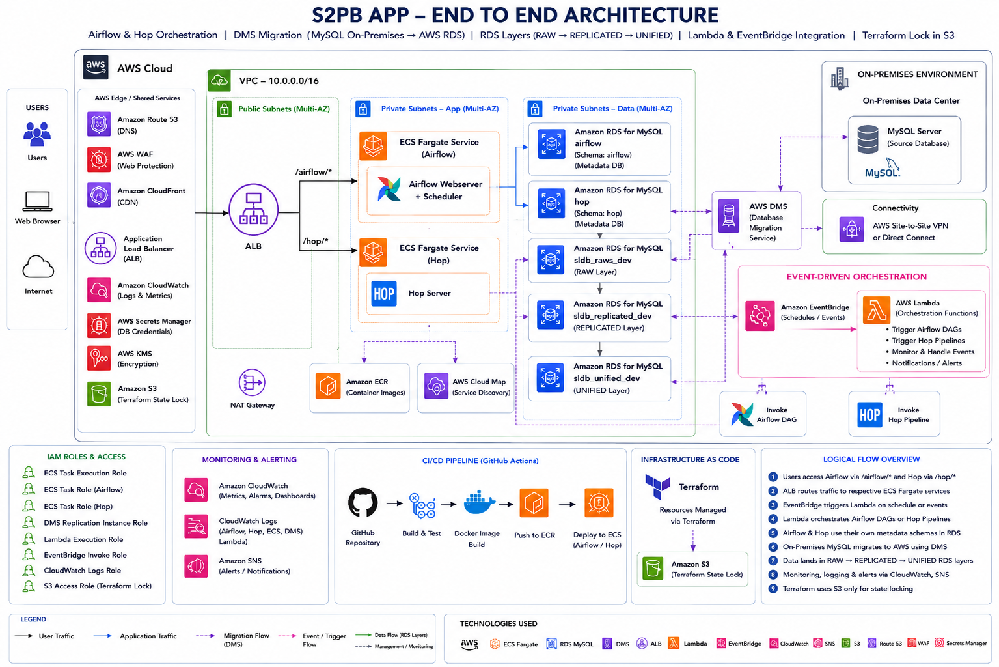

# Enterprise Data Orchestration & Migration Platform on AWS

## Overview

This project implements a cloud-native enterprise data orchestration and migration platform on AWS using:

* Apache Airflow
* Apache Hop
* AWS ECS Fargate
* AWS DMS
* Amazon RDS MySQL
* Terraform
* GitHub Actions
* Amazon EventBridge
* AWS Lambda
* CloudWatch

The platform is designed for hybrid cloud environments where on-premises MySQL databases are migrated and orchestrated in AWS.

---

# Architecture

## Diagram



## High-Level Flow

On-Premises MySQL
↓
AWS DMS Migration
↓
RAW RDS Layer
↓
REPLICATED RDS Layer
↓
UNIFIED RDS Layer
↓
Airflow + Hop Orchestration

---

# AWS Services Used

| Service                   | Purpose                        |
| ------------------------- | ------------------------------ |
| Amazon ECS Fargate        | Container orchestration        |
| Amazon ECR                | Docker image repository        |
| Application Load Balancer | Path-based routing             |
| Amazon RDS MySQL          | Data storage                   |
| AWS DMS                   | Database migration             |
| AWS Lambda                | Event-driven triggers          |
| Amazon EventBridge        | Scheduling and orchestration   |
| Amazon CloudWatch         | Logging and monitoring         |
| IAM                       | Security and access management |
| Terraform                 | Infrastructure as Code         |
| GitHub Actions            | CI/CD automation               |

---

# Project Structure

```text
bpay-etl/
│
├── airflow-orchestration/
│   ├── dags/
│   ├── plugins/
│   ├── docker/
│   ├── requirements.txt
│   └── airflow.cfg
│
├── hop-orchestration/
│   ├── workflows/
│   ├── pipelines/
│   ├── jdbc/
│   ├── config/
│   ├── scripts/
│   └── docker/
│
├── infra/
│   ├── modules/
│   │   ├── airflow/
│   │   ├── hop/
│   │   ├── ecs/
│   │   ├── rds/
│   │   ├── dms/
│   │   ├── vpc/
│   │   ├── lambda/
│   │   └── eventbridge/
│   │
│   ├── environments/
│   └── main.tf
│
└── .github/
    └── workflows/
```

---

# Airflow Setup

## Features

* ECS Fargate deployment
* MySQL metadata database
* DAG orchestration
* XCom support
* CloudWatch logging
* ALB path-based routing

## Airflow URL

```text
http://<alb-dns>/airflow
```

---

# Apache Hop Setup

## Features

* ETL pipelines
* Workflow orchestration
* ECS Fargate deployment
* CloudWatch logging
* ALB path-based routing

## Hop URL

```text
http://<alb-dns>/hop
```

---

# Database Architecture

## Databases

| Database            | Purpose                    |
| ------------------- | -------------------------- |
| airflow             | Airflow metadata           |
| hop                 | Hop metadata/configuration |
| bpaydb_raw_dev        | Raw ingestion layer        |
| bpaydb_replicated_dev | Replicated data            |
| bpaydb_unified_dev    | Unified/reporting layer    |

---

# CI/CD Pipeline

## GitHub Actions

### Airflow Deployment

Triggered on:

```text
airflow-orchestration/**
```

### Hop Deployment

Triggered on:

```text
hop-orchestration/**
```

## CI/CD Flow

GitHub Commit
↓
GitHub Actions
↓
Docker Build
↓
Push to Amazon ECR
↓
ECS Force Deployment

---

# Infrastructure as Code

Terraform is used for:

* VPC
* ECS
* ALB
* RDS
* DMS
* IAM
* Lambda
* EventBridge
* CloudWatch

---

# ECS Path-Based Routing

## ALB Listener Rules

| Path       | Service     |
| ---------- | ----------- |
| /airflow/* | Airflow ECS |
| /hop/*     | Hop ECS     |

---

# Monitoring

## CloudWatch

* ECS Logs
* Airflow Logs
* Hop Logs
* Scheduler Logs
* ECS Metrics

---

# Security

* IAM least privilege access
* Private RDS subnets
* Security Groups
* ECS Task Roles
* ALB controlled ingress

---

# Deployment

## Terraform

```bash
terraform init
terraform plan
terraform apply
```

## GitHub Actions

Deployment is fully automated through GitHub Actions workflows.

---

# Docker Images

## Airflow

```text
apache/airflow:2.10.0
```

## Hop

```text
apache/hop:2.15.0
```

---

# Event-Driven Orchestration

AWS Lambda and EventBridge are integrated for:

* Scheduled workflow execution
* Event-based orchestration
* Automated pipeline triggering

---

# Key Features

✅ Hybrid Cloud Architecture
✅ AWS DMS Migration
✅ Apache Airflow Orchestration
✅ Apache Hop ETL Pipelines
✅ ECS Fargate Deployment
✅ CI/CD Automation
✅ Infrastructure as Code
✅ CloudWatch Monitoring
✅ ALB Path-Based Routing
✅ Event-Driven Workflows

---

# Technologies

* AWS
* Docker
* Terraform
* Apache Airflow
* Apache Hop
* ECS Fargate
* MySQL
* AWS DMS
* GitHub Actions
* CloudWatch
* Lambda
* EventBridge

---

# Future Enhancements

* HTTPS with ACM
* Route53 custom domains
* ECS auto scaling
* Secrets Manager integration
* Multi-environment promotion
* Data quality validation pipelines

---

# Author

Vadivel P M

Cloud | DevOps | Data Platform Engineering
